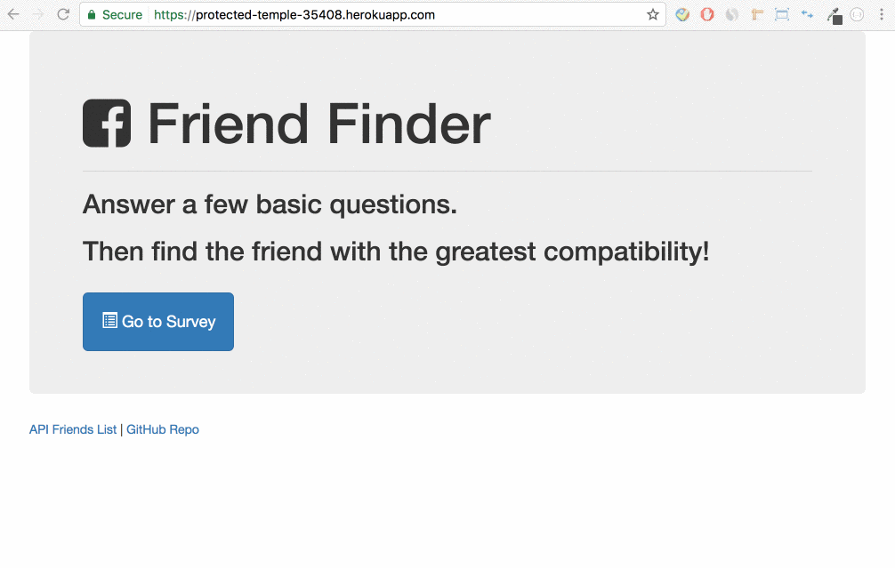

# FriendFinder

## Table of Contents 

1. [Overview](#overview)
2. [Installation](#installation)
3. [Initializing](#initializing)
	- [Local Server](#local-server)
	- [Heroku](#heroku)
4. [How It Works](#how-it-works)

<a name="overview"></a>
## Overview

FriendFinder is a compatibility-based, Heroku deployed app that utilizes Express to handle routing. It takes in survey results from a user and compares the answers with other's to find the best overall match for the user.

<a name="installation"></a>
## Installation

### Step 1: Git Clone

Clone FriendFinder to your local git repo like the following:

```
git clone https://github.com/caseykwok/FriendFinder.git
```

The FriendFinder project and its files should now be in your project folder.

### Step 2: Install Dependencies

Install all modules listed as dependencies in `package.json` like the following:

```
npm install
```

The dependencies should now be in the local `node_modules` folder.

<a name="initializing"></a>
## Initializing

There are two ways to run this application. The user can either run the application on their local server or access the application deployed to Heroku.

<a name="local-server"></a>
### Local Server

1. Ensure the two steps in [Installation](#installation) are completed.

2. Run the Node application called `server.js` to initialize the user's local server like the following:

	```
	node server.js
	```

3. Open the browser and connect to [port 3000 of the local host](http://localhost:3000/) to reach the homepage.

<a name="heroku"></a>
### Heroku

1. Open the browser and go to the [deployed Heroku application](https://protected-temple-35408.herokuapp.com/) to reach the homepage.

	- **Note:** It is unnecessary to complete the two steps in [Installation](#installation).

<a name="how-it-works"></a>
## How It Works

1. The homepage will allow the user to do one of the following:

	- **Go to Survey** will redirect the user to the survey page
	- See **API Friends List** will display a list of all users to compare against the user's answers and find the best compatibility
	- Go to **GitHub Repo** will redirect the user to the repository with all the source code for this application

2. Once the user has completed the survey, the application will check if all fields are completed and if the photo URL provided refers to a valid image.

	- If **yes**, the application will show the user the name and the picture of their best match.
	- If **no**, the application will alert the user to fill out all fields and provide a valid photo URL.


